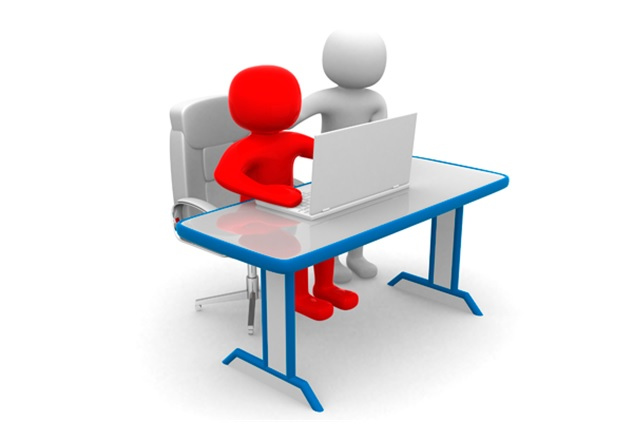

## TÉCNICAS EFECTIVAS PARA UNA CLASE

### c) Estructura de una clase

Toda clase bien planificada debe seguir un orden claro, que permita tanto al profesor, como a los alumnos visualizar el propósito que se quiere lograr a través de ella. Esto no significa rigidizar la clase, sino ser flexible y oportuno para adaptarse a las necesidades que van surgiendo de los estudiantes y a rediseñar si es necesario, las actividades (individuales o grupales) que se desarrollan,  permitiendo un uso eficiente del tiempo, del espacio y de los recursos. A continuación te invitamos a observar este video de la estructura implementada por un colegio en sus cursos más pequeños. 

https://vimeo.com/197505639

La estructura que se propone se divide de la siguiente manera:

- Inicio
- Desarrollo
Contenido Nuevo
Práctica guiada
Práctica Individual/Colaborativa
- Cierre

#### Inicio

La primera parte de la clase es fundamental, es donde tenemos que presentar el objetivo de la clase, las expectativas de comportamiento y prender motores, es decir, levantar conocimiento previo necesario para la clase. El inicio tiene tres aspectos que resultan efectivas en el aprendizaje: 

Motivación del tema. En este momento el profesor captará la atención de sus estudiantes con el objetivo de incorporarlos a la clase. Ejemplo: Contar una anécdota, plantear una situación problemática, mostrar una presentación multimedia, observar una imagen, plantear una pregunta desafiante, escuchar una noticia, etc. No debe descuidar que lo planteado sea alusivo al tema de la clase, que involucre a los alumnos, los active y les recuerde en qué están.

Presentación del objetivo de la clase.  En este momento el profesor da a conocer a sus estudiantes qué pretende que ellos logren y la estrategia metodológica que utilizará para trabajar. Además, debe destacar la importancia y el para qué de la clase.

Activación de los conocimientos previos respecto de los contenidos a abordar. El profesor intenciona preguntas que permitan al alumno relacionar el nuevo aprendizaje a trabajar con los conocimientos que ya tienen. Tener presente que cada clase necesariamente debe articularse con la anterior. Recordar que es importante manifestar altas expectativas sobre las posibilidades de aprendizaje y desarrollo de todos sus alumnos 

#### Desarrollo

Contenido nuevo

Lo que nos sucede muchas veces al hacer clases es que nos quedamos “pegados” en explicar el contenido nuevo. Con otras palabras, nuestra clase se transforma en algo totalmente expositivo. Grave error! Debemos hacer el esfuerzo para que la parte expositiva sea concreta y sencilla. Aunque a veces es difícil, debemos intentarlo. 

Cosas que debemos tener en consideración en esta parte de la clase es: 

- Atención del 100% de los estudiantes. Si es un contenido nuevo, los estudiantes deben estar concentrados y escuchando la nueva información. 
- Verificar constantemente si los estudiantes están interiorizando el nuevo contenido. 
- La concentración no es nuestra mejor característica. La exposición del nuevo contenido no debe durar más de 30 minutos, ojala menos que eso. 

Práctica Guiada

En esta parte debemos modelar cómo hacer un ejercicio o actividad que deseamos que nuestras alumnas hagan para cumplir el objetivo de la clase.

Cosas que debemos tener en consideración en esta parte de la clase es: 
- Modelar la actividad y habilidad que queremos trabajar con las alumnas.  
- Verificación de la comprensión constantemente. Tenemos que estar revisando si las alumnas están “siguiendo” el modelamiento que estamos haciendo. 

Práctica Independiente/Colaborativa

En la práctica individual/colaborativa es la oportunidad que los alumnos pueden internalizar y moldear lo aprendido. 

Cosas que debemos tener en consideración en esta parte de la clase es: 

- En esta parte de la clase el alumno ejercita individual y/o grupalmente la habilidad y el contenido enseñado.
- El alumno moldea y empieza a internalizar lo aprendido. El alumno es capaz de aplicar lo aprendido en otras contextos. 
- Esta parte de la clase debiese ser la más larga en tiempo para que los alumnos realmente puedan poner en práctica lo aprendido. 
- En esta parte los estudiantes son los protagonistas, pero no significa que nosotros estemos sentados. Debemos estar monitoreando y resolviendo dudas que a los alumnos les vaya surgiendo en la práctica.

Cierre

Esta etapa es la más abandonada porque no nos alcanza el tiempo muchas veces. El cierre tiene un gran importancia en el proceso de aprendizajes porque es donde se invita a los estudiantes a efectuar una metacognición de lo vivido en la clase, es decir, a que tomen conciencia de sus progresos, de sus nuevos aprendizajes, puedan extraer conclusiones, evaluar los aprendizajes y lograr la generalización o transferencia de los aprendizajes.

Cosas que debemos tener en consideración en esta parte de la clase es: 

- Si queremos lograr hacer un cierre que logre los objetivos, debemos tener una planificación que considere los tiempos de cada etapa y actividad de la clase. 
- Debemos verificar si el aprendizaje fue efectivo. Esto se puede hacer a través de un test de salida o cualquier otra actividad que nos de data.

## PLANIFICACION EJEMPLO

A continuación se les presentará una planificación de ejemplo de un taller a profesores sobre “Planificación y Verificación de la Comprensión”. 

Es un taller de más de 3 horas de duración donde la expositora planificó cada actividad detallando el tiempo que le tomaría cada momento del taller. De esta manera, ella logró realizar todas las partes planificadas en la clase incluyendo el cierre. 

Click aquí para ver la planificación (https://docs.google.com/document/d/1mRM3wAcoagXHCDcNjpeQmJoUY8nY351MLwHnBtIViTo/edit)

[Seguimos? Vamos](05-agenda.md)
