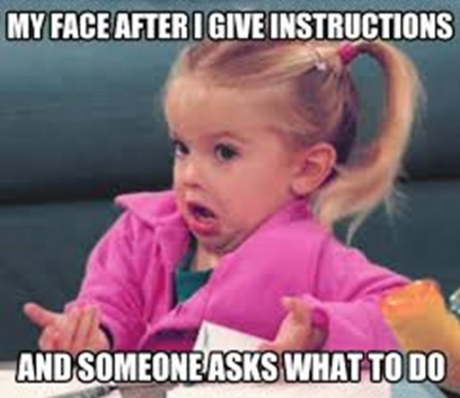

## TÉCNICAS EFECTIVAS PARA UNA CLASE

### d) “AGENDA” DE LA CLASE CLARA Y VISIBLE PARA LAS ALUMNAS

Al igual que el objetivo de la clase, las alumnas al inicio de la clase deben saber qué harán durante las 3 horas. Esto alínea expectativas de las alumnas lo que permite bajar ansiedad e incertidumbre desde el inicio de la clase. Sería aún mejor si la agenda se presenta antes de la clase para que las alumnas sepan previamente a qué vendrán a clases. 

La agenda deberá detallar los tiempos que tomará cada parte de la sesión. De esta manera, el profesor como las alumnas estarán conscientes de los tiempos.

En este parte, se puede aprovechar de entregar las expectativas de comportamiento. Es decir, qué deben hacer ellas para que cada parte de la clase se cumpla. Ejemplo: a) “.... deberán estar concentradas y mirando mi explicación porque esta materia es más desafiente”, b) “... en esta parte de la clase deberán ser muy participativas porque…”.

### e) INSTRUCCIONES  CLARAS

Muchas veces nos pasa que llegamos a nuestra clase con nuestros materiales y nuestra buena voluntad y, ¡zas! fallamos: nuestros alumnos no nos entienden.

Es muy fácil que arruinemos un buen material didáctico con unas instrucciones inapropiadas y nos quejemos: "¿Cómo es que no nos han entendido si lo he explicado bien y lento?".

A todos nos ha pasado muchas veces que después de haber proporcionado todo tipo de detalles sobre cómo hacer una actividad en cuestión, de haber hecho la típica pregunta: ¿Han entendido? y haber afirmado los alumnos con la cabeza, cuando nos hemos puesto  a dar vuelta por la sala, en realidad, nuestros alumnos no saben por dónde empezar. No nos han entendido (lo suficiente). Por eso el momento de las instrucciones es trascendental dentro de una clase y así lo vamos a tratar: como un aspecto de la clase que si no lo trabajamos lo suficiente, nos puede traer bastantes contratiempos y dificultar el éxito, además de favorecer la desmotivación de nuestros alumnos.

Por lo tanto, vamos a dar estrategias para dar instrucciones claras porque son primordiales al minuto de ejecutar en una clase. 

a) Silencio y atención absoluta. Si tu instrucción o información es importante, debemos esperar la atención completa de la clase. Es decir, miradas hacia el profesor, pantallas de los computadores abajo y nadie conversando. Si es que las alumnas están conversando o desconcentradas en otra cosa, estamos señalando que la información que se dará no es relevante. 

b) Planifica las instrucciones de las actividades previamente. Ponte en la piel del estudiante y pregúntate si con las instrucciones que vas a dar, te van a entender. Escoge las palabras clave que sabes que conocen o pueden inferir fácilmente: escribe, escucha, dibuja, habla con tu compañero, lee, pregunta, etc. Repasa la actividad mentalmente y anticipa los posibles problemas que pueden surgirles para la comprensión del mensaje.

c) Pregúntate: ¿estoy dándoles toda la información que necesitan para realizar la actividad o tarea en cuestión? Nos tenemos que dar cuenta de que nosotros estamos muy familiarizados con el material que llevamos a la clase y con la mecánica de las actividades, pero nuestros estudiantes puede que sea la primera vez que trabajan una actividad así y necesitan conocer cada paso.

d) Sé breve, claro y conciso en la explicación, no te extiendas más de lo necesario contando cosas que en ese momento los alumnos no van a necesitar, como qué van a hacer luego, o algún tipo de comentario intrascendente u obvio. Ve al grano y sé preciso. Como dicen algunos expertos, utiliza la Economía del Lenguaje.

e) Dosifica la instrucción. Si tiene diferentes pasos o es complicada la mecánica de la actividad, divide la instrucción en varias partes. Das una instrucción, les indicas que hagan esa parte y después explicas el resto o lo divides igualmente en partes.

f) Modela lo que tienes que hacer siempre que sea posible; es más rentable que explicar. Muestra a todos bien la actividad en cuestión.

g) Comprueba y asegúrate de que las alumnas entendieron cada paso de la explicación. Debes ser preguntas dirigidas y no abiertas. Puedes apoyarte en uno o dos alumnas para que lo expliquen al resto de la clase con sus palabras. Las preguntas deben ser dirigidas y concretas. Algunos ejemplos: “¿Qué tienen que hacer?”; ”¿Cómo tienen que hacer la actividad?” ; “¿Cuánto tiempo tienen para hacerlo?”

h) Obsérvate, sé consciente y abierto al feedback de cómo das las instrucciones en clase. ¿Qué es lo positivo que haces? ¿Qué aspecto crees que puedes mejorar? ¿Qué pasos vas a seguir para conseguirlo? Ten paciencia y date tiempo; vas por muy buen camino.

MUY IMPORTANTE!
Verificar comprensión de las instrucciones después de decirlas.

[Vamos! nos queda la última ténica](05.1.instrucciones.md)
